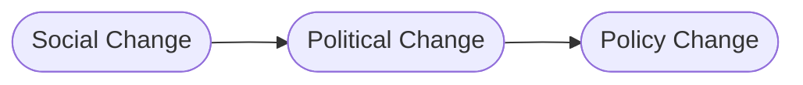

---
{"dg-publish":true,"permalink":"/overton-window-is-a-range-of-possibilities/"}
---

# Overton Window is a range of possibilities

The Overton Window (originally intended to describe the domain of politics and generalized here) refers to ==some group of **adjacent outcomes along a spectrum that fall into a window of possibility**==. Outcomes inside the window are deemed **acceptable by those who hold power**, meaning they could support the outcome and not lose power. Policies outside the window are unacceptable at the moment. ==**Ideas**, over time, can shift the size or spread of the window of possible outcomes.== Social change affects political change which makes possible policy change.[^1]

---

> **Ideas take time to produce changes in policy**. This can be frustrating, but it also means that ideas policymakers refuse to countenance now may yet — with patience — become law... ==The migration from mere ideas to the law of the land can be described by a model called **the Overton Window**.==

> At any one time, ==some group of adjacent policies along the freedom spectrum fall into a "window of political possibility."==
	- **Policies inside the window are politically acceptable**, meaning *officeholders believe they can support the policies and survive the next election*. 
	- **Policies outside the window, either higher or lower, are politically unacceptable at the moment**. If you shift the position or size of the window, you change what is politically possible.

> In our understanding, ==politicians typically don't determine what is politically acceptable; more often they react to it and validate it.== Generally speaking, **policy change follows political change, which itself follows social change.** The most durable policy changes are those that are undergirded by strong social movements.

---
#politics #sociology

see also:

- [[Adjacent Possible is the edge of the future\|Adjacent Possible is the edge of the future]]

[^1]: Overton, Joseph. “The Overton Window.” The Mackinac Center for Public Policy, http://www.mackinac.org/OvertonWindow. 